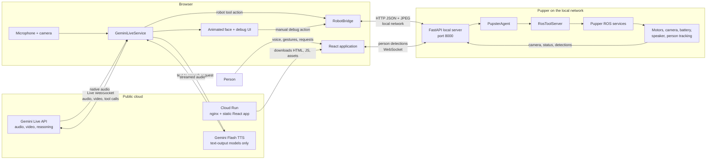
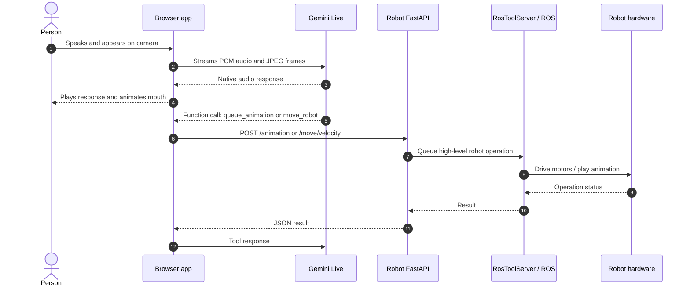
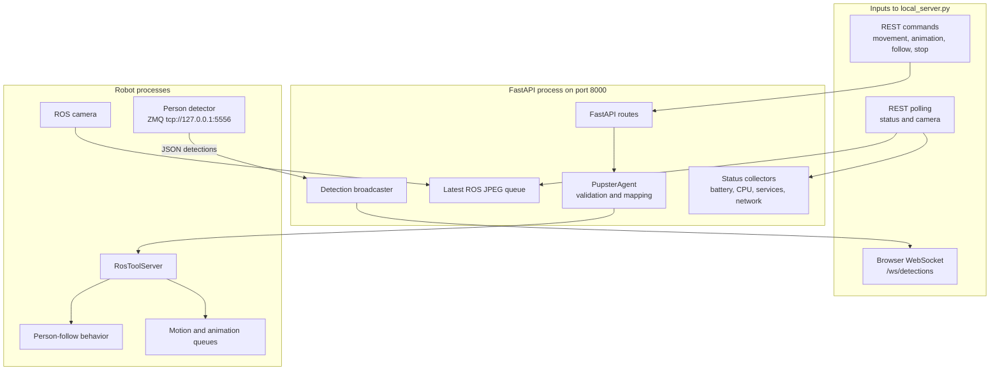
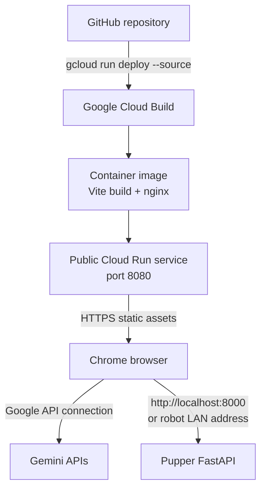

# Gemini Pupper Architecture

This page explains how the browser application, Gemini models, and the physical Pupper robot work together.

## The 30-second explanation

Gemini Pupper is a browser-based voice and vision interface for a robot dog. The browser captures microphone and camera data and streams it directly to Gemini Live. When Gemini decides the robot should move or perform a trick, it returns a structured function call. The browser translates that call into an HTTP request to a small FastAPI server running locally on the robot. That server uses the Pupper ROS stack to queue motion, animation, and follow-person commands.

The cloud deployment serves the web application; it does not proxy robot commands or media. The browser is the coordinator between Gemini and the robot.

## System at a glance



### Responsibility boundaries

| Area | Responsibility | Important code |
|---|---|---|
| Cloud Run | Builds and serves the static browser application through nginx | [Dockerfile](../Dockerfile), [nginx.conf](../nginx.conf) |
| React application | Owns UI state, settings, logs, connection state, and periodic status polling | [App.tsx](../App.tsx) |
| Gemini integration | Captures media, opens the Live session, plays audio, executes tool calls, and returns tool results | [services/geminiLive.ts](../services/geminiLive.ts) |
| Robot bridge | Maps browser operations to the robot's HTTP API | [services/robotBridge.ts](../services/robotBridge.ts) |
| Robot API | Exposes control, camera, tracking, and telemetry endpoints on port 8000 | [robot/local_server.py](../robot/local_server.py) |
| Robot stack | Converts high-level requests into queued ROS motion and behavior operations | [Pupper v3 monorepo](https://github.com/Nate711/pupperv3-monorepo) |

## End-to-end conversation and action

The browser, rather than Cloud Run, owns the live conversation and function-call loop.



A manual button in the debug view enters the same path at the browser-to-robot HTTP step, bypassing Gemini. This makes it useful for checking the robot connection and motion APIs independently.

## Audio and model modes

The application supports two response patterns:

### Native-audio Live models

Gemini 3.1 Flash Live and Gemini 2.5 Flash Native Audio return audio directly through the Live session.

```text
microphone -> browser -> Gemini Live -> native audio -> browser speakers
```

The separate `speak` tool is intentionally not advertised to native-audio models.

### Text-output robotics model

The Robotics ER streaming model returns text and can call the `speak` tool. The browser sends that text to the selected Gemini Flash TTS model and plays the returned audio.

```text
robotics model text -> speak tool -> Gemini Flash TTS -> browser speakers
```

Gemini 3.1 Flash TTS is consumed as a stream, so playback can begin before the entire utterance has been generated. Gemini 2.5 Flash TTS uses a complete-response request because that model does not support TTS streaming.

## Robot-side architecture

The robot server is a translation and observation layer between browser-friendly protocols and the Pupper ROS environment.



### Robot command API

| Purpose | Method and path | Browser caller |
|---|---|---|
| Activate or relax motors | `POST /walking/activate`, `POST /walking/deactivate` | Wake/sleep tools |
| Move with velocities | `POST /move/velocity` | Gemini movement tools and debug controls |
| Move by heading | `POST /move/direction` | Directional debug control |
| Stop or clear work | `POST /queue/stop`, `POST /queue/reset`, `POST /stop/immediate` | Safety and debug controls |
| Play a trick | `POST /animation` | Gemini animation tool and debug controls |
| Follow a person | `POST /following/activate`, `POST /following/deactivate` | Follow-mode tool |
| Read camera | `GET /camera/image` | Debug view and optional Gemini vision source |
| Read health | `GET /system/status` | Face warnings and debug status bar |
| Track a person | `WS /ws/detections` | Animated eye direction |
| Set speaker volume | `POST /system/volume` | Debug control |

The animation endpoint maps friendly identifiers such as `wave` or `sneeze` to animation recordings in the robot stack. It also queues a wait based on the recording duration so later actions do not overlap the animation.

### Camera and person tracking

There are two distinct visual paths:

1. **Vision sent to Gemini:** The app can use the browser camera or poll `/camera/image` from the robot. Frames are resized, JPEG-compressed, and sent to the Live session.
2. **Eye animation:** The face can track the mouse, run MediaPipe in the browser, or consume person detections from the robot. In robot mode, a local detector publishes JSON over ZMQ; the FastAPI process forwards it to the browser over `/ws/detections`.

These paths are independent: changing the animated-eye tracking source does not necessarily change which camera Gemini sees.

### Telemetry

The robot API assembles status from several local sources:

- Battery percentage and voltage from the Pupper battery utility
- CPU utilization and temperature through `psutil`
- Robot service state through `systemctl is-active robot`
- Internet reachability through a short socket connection test

The main application polls slowly for critical warnings, while the debug panel polls more frequently for operator feedback.

## Deployment and network topology



The Cloud Run container contains only static files and nginx. There is no application backend in Cloud Run and robot traffic does not pass through Google Cloud.

The default robot URL is `http://localhost:8000`. This works when Chrome runs on the Pupper itself. If Chrome runs on another computer, set the Robot API URL to the Pupper's reachable LAN address and ensure browser mixed-content and local-network permission policies allow that connection.

## Trust and safety boundaries

- The Gemini API key is entered in the browser settings and stored in browser local storage. It is used for direct browser-to-Gemini connections.
- The robot FastAPI server currently permits all CORS origins and does not authenticate control requests.
- Keep port 8000 on a trusted robot/local network. Do not expose it directly to the public internet.
- Motion commands can move physical hardware. Use the immediate-stop path when behavior is unexpected, and keep physical clearance around the robot.
- The server includes maintenance endpoints such as upgrade and restart. Network isolation is therefore important even if the browser UI does not normally invoke them.

## Startup lifecycle

1. The `llm-agent` service starts the FastAPI process on the robot.
2. FastAPI's lifespan hook creates `RosToolServer` and wraps it in `PupsterAgent`.
3. If ZMQ is available, a background subscriber connects to the local person-detection publisher.
4. The user opens the Cloud Run URL in Chrome.
5. The browser loads settings and connects to the robot API.
6. When the user wakes Pupster, the browser requests media access and opens the Gemini Live session.
7. Gemini responses, robot commands, status polling, and tracking streams then operate independently until disconnect.

## Failure isolation

| Symptom | Likely boundary to inspect |
|---|---|
| Page does not load | Cloud Run, nginx, browser cache |
| Camera or microphone unavailable | Browser permissions, HTTPS secure context, Linux audio/video devices |
| Gemini connects and immediately closes | Model ID, API key, unsupported Live configuration; inspect close code in debug logs |
| Voice works but robot does not move | Robot API URL, LAN access, CORS/mixed-content policy, `llm-agent` |
| Manual controls work but Gemini actions do not | Gemini function declarations and tool-call handling |
| Robot moves but eye tracking is absent | ZMQ detector, port 5556 publisher, `/ws/detections` |
| Debug status is empty | `/system/status`, robot service, battery script, network reachability |

## Related documentation

- [Project overview and setup](interactive-robot-dog.md)
- [Robot-side server](../robot/local_server.py)
- [Repository README](../README.md)
- [Pupper v3 robot stack](https://github.com/Nate711/pupperv3-monorepo)
